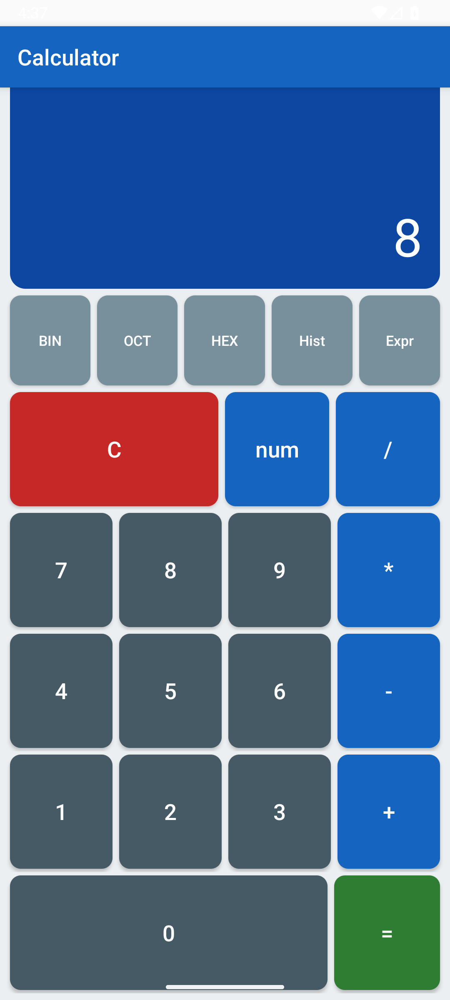
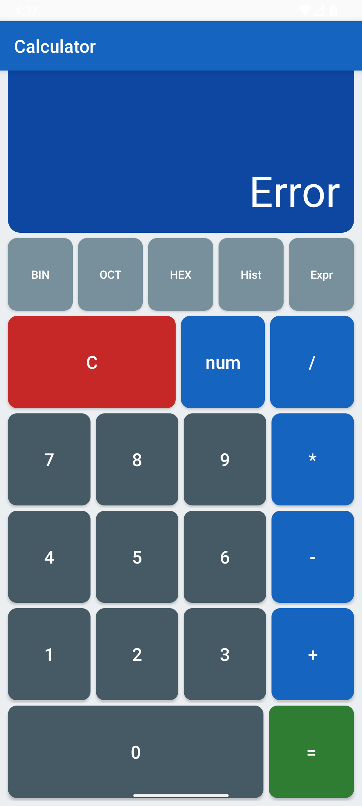
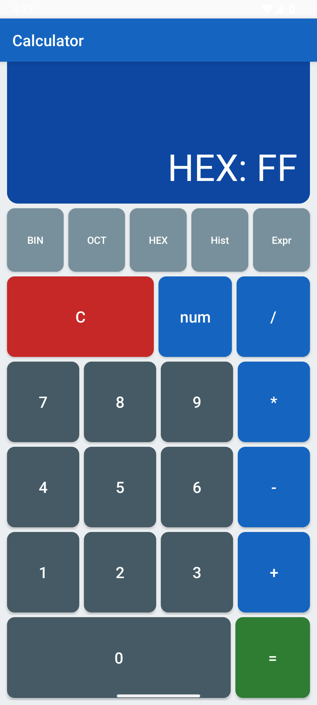
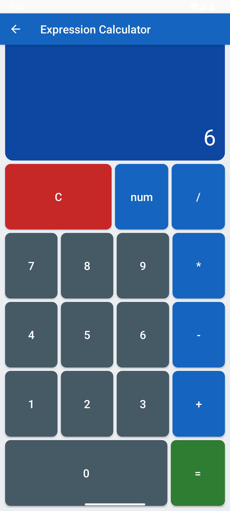
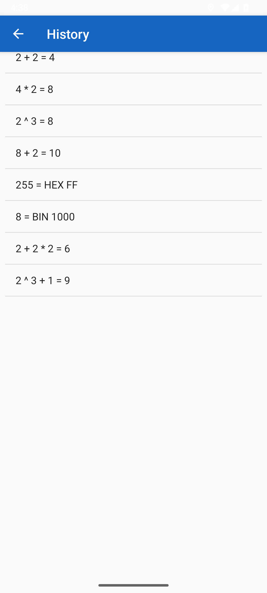

# Lab 3 — Calculator (Android, Java)

- **Course:** Introduction to Mobile Systems
- **Lab number:** 3
- **Student:** Hasan Yilmaz
- **Student ID:** 56505

**Description:** An Android calculator (Java) with a numeric keypad and a display at the top. The basic mode evaluates strictly left-to-right without precedence (2 + 2 * 2 = 8) and includes a power button, while a separate expression mode respects operator precedence (2 + 2 * 2 = 6) using the shunting-yard algorithm. Bonus features include BIN/OCT/HEX conversion, an operation history screen, and safe handling of division by zero and invalid input.

Android Studio project (Java) implementing **all three parts** of the calculator assignment.

## Part 1 — Basic calculator (mandatory)

`MainActivity` — numeric keypad with the display at the top.

- Digits 0–9, operators `+ - * /`, `=`, `C`, and the **num** button that performs the power operation `^`.
- **Immediate (sequential) evaluation** — operations are applied left-to-right in the order they are entered, without precedence: `2 + 2 * 2 =` → **8** (after pressing `*` the display already shows `4`).
- Chained operations: every operator press computes `previousResult (op) currentInput` immediately; `=` finishes the pending operation; after `=` a digit starts a new calculation, an operator continues from the result.
- `2 num 3 =` → **8**.
- Division by zero shows **Error** without crashing; in the error state all keys are ignored until `C` resets the calculator.
- Documented rule: pressing an operator without entering a number first uses the value currently shown in the display (initially 0); pressing two operators in a row replaces the pending operator.

## Part 2 — Extensions (bonus)

- **2.1 Graphical buttons** — custom rounded backgrounds (`res/drawable/btn_*.xml`) that change color while pressed.
- **2.2 Number bases** — `BIN` / `OCT` / `HEX` buttons convert the current displayed value. Documented rule: the conversion applies to the current result; **if the value is not an integer, the app shows Error** (reset with `C`). Example: `255 = HEX` → `HEX: FF`. Conversions are also recorded in history.
- **2.3 History** — the `Hist` button opens a separate Activity listing all operations since app launch, one per line, e.g. `2 + 2 = 4`.

## Part 3 — Expression calculator (bonus)

`ExpressionActivity` (opened with the `Expr` button) builds the whole expression first and evaluates it only on `=`, **with operator precedence**:

- `2 + 2 * 2 =` → **6**; `2 num 3 + 1 =` → **9** (`^` binds strongest and is right-associative).
- Implemented with the **shunting-yard algorithm** (infix → Reverse Polish Notation) followed by **stack-based RPN evaluation** in [ExpressionEvaluator.java](app/src/main/java/com/mertyilmaz/lab3/ExpressionEvaluator.java).
- No limit on the number of operands/operators; two operators in a row replace each other; a trailing operator is dropped on `=`.
- **Responsive layout** — both keypads use weight-based `LinearLayout` rows: buttons fill the available width and keep their proportions on any screen size (phone/tablet).

## Verified on the API 36 emulator

| Input | Result |
|---|---|
| `2 + 2 * 2 =` (basic) | 8 |
| `2 num 3 =` | 8 |
| digit after `=` | starts a new calculation |
| `5 / 0 =` | Error, no crash, `C` resets |
| `255 = HEX` | HEX: FF |
| `8 BIN` | BIN: 1000 |
| `2 + 2 * 2 =` (expression) | 6 |
| `2 num 3 + 1 =` (expression) | 9 |

## Screenshots

| Main screen | 2 + 2 * 2 = 8 (Part 1) | 2 num 3 = 8 |
|---|---|---|
|  |  |  |

| Division by zero | HEX conversion | 2 + 2 * 2 = 6 (Part 3) | History |
|---|---|---|---|
|  |  |  |  |

## Build & run

Open in Android Studio and press **Run**, or:

```bash
./gradlew assembleDebug
# APK: app/build/outputs/apk/debug/app-debug.apk
```

compileSdk/targetSdk 36, minSdk 26, Java 11 source level, AGP 8.11, Gradle 8.14.3. No third-party dependencies (AndroidX AppCompat only).
